# Master Plan Remediasi & Rekomendasi Perbaikan — KelasWFA Newsletter
**Target Audiens:** Handoff Guide untuk Coding Agent & Tim Engineering  
**Tanggal Penyusunan:** 15 September 2026  
**Basis Analisis:** Hasil Cross-Check 13 Laporan Audit (`audits/01-functional-correctness.md` s/d `audits/13-prd-compliance.md`) terhadap Codebase `HEAD` (`f8526f0`)  
**Status Kesiapan:** **GO BERSYARAT** (2 Blocker Operasional + 10 Syarat Kepatuhan Peluncuran)

---

## DAFTAR ISI
1. [Panduan Eksekutif & Guardrail Coding Agent](#1-panduan-eksekutif--guardrail-coding-agent)
2. [Matriks Temuan & Pemetaan Prioritas](#2-matriks-temuan--pemetaan-prioritas)
3. [Fase 0: Blocker Operasional & Infrastruktur (P0)](#fase-0-blocker-operasional--infrastruktur-p0)
4. [Fase 1: Kepatuhan PRD §12, Keamanan Kritis & Aksesibilitas (P1)](#fase-1-kepatuhan-prd-12-keamanan-kritis--aksesibilitas-p1)
5. [Fase 2: Arsitektur, Hardening Keamanan, Performa & Edge Cases (P2)](#fase-2-arsitektur-hardening-keamanan-performa--edge-cases-p2)
6. [Fase 3: Pembersihan Kode, UI Polish & Dokumentasi (P3)](#fase-3-pembersihan-kode-ui-polish--dokumentasi-p3)
7. [Fase 4: Checklist Pra-Launch Operator (Runbook Ops)](#fase-4-checklist-pra-launch-operator-runbook-ops)
8. [Roadmap Dependensi & Urutan Kerja Paralel](#8-roadmap-dependensi--urutan-kerja-paralel)

---

## 1. PANDUAN EKSEKUTIF & GUARDRAIL CODING AGENT

Dokumen ini disusun sebagai spesifikasi teknis lengkap yang siap diserahkan kepada **coding agent** untuk mengeksekusi seluruh perbaikan tanpa ambiguitas. Coding agent wajib mematuhi panduan dasar arsitektur berikut:

### Guardrail Implementasi:
1. **Zona Modifikasi**: 
   - Modifikasi hanya dilakukan pada file implementasi kode terkait di `src/`, `scripts/`, `drizzle/`, `Dockerfile`, `package.json`, dan file dokumentasi `docs/`, `README.md`.
   - File audit `audits/01`–`13` adalah catatan historis audit dan **TIDAK BOLEH diubah**.
2. **CSS & Desain Token**:
   - Seluruh style menggunakan CSS variables dari `src/styles/tokens.css`.
   - Dilarang menambahkan warna hex hardcoded baru di dalam komponen Astro.
   - Gunakan font `Plus Jakarta Sans` dan pertahankan rasio kontras WCAG AA (minimum 4,5:1 untuk teks normal).
3. **Konvensi Bahasa & Komunikasi**:
   - Copy teks antarmuka publik dan admin menggunakan Bahasa Indonesia (dengan mirror EN di `src/pages/en/`).
   - Penamaan variabel kode, fungsi, dan komentar kode menggunakan Bahasa Inggris.
4. **Keamanan & Kebersihan CSP**:
   - CSP disetel `script-src 'self'`. Dilarang menggunakan inline event listener (`onclick="..."`, `onsubmit="..."`).
   - Gunakan `addEventListener` di dalam tag `<script>` pada halaman `.astro`.
5. **Akses Environment Variable**:
   - Selalu akses env runtime melalui fungsi helper `env(name, fallback)` dari `src/lib/env.ts`. Hindari membaca `process.env.*` secara langsung kecuali pada skrip setup atau build config.
6. **Integritas Pengujian**:
   - Jalankan `npm test` (Vitest) dan pastikan seluruh test suite tetap hijau.
   - Tambahkan unit test baru untuk fungsi-fungsi logika bisnis baru/termodifikasi di `test/`.
   - Periksa integritas E2E dengan `npx playwright test`.

---

## 2. MATRIKS TEMUAN & PEMETAAN PRIORITAS

| ID Temuan | Kategori | Modul Terkait | Ringkasan Masalah | Prioritas |
|---|---|---|---|:---:|
| `10-DEP1` / `12-DOC4` | Blocker Ops | Dockerfile & Scripts | `npm prune` membuang `tsx` & `src/` tidak disalin; migrasi di container gagal | **P0** |
| `10-DEP4` / `12-DOC2` | Blocker Ops | Astro Build & Vercel | `@astrojs/vercel` absen; deploy SSR ke Vercel tidak berfungsi apa adanya | **P0/P1** |
| `04-A1` / `01-F2` | Invarian DB | Broadcast Machine | Race condition single-`sending` belum dikunci partial unique index Postgres | **P1** |
| `03-C4` | Tooling CI | Package & Build | `typescript` dan `@astrojs/check` absen; tidak ada type check otomatis | **P1** |
| `05-S4` | Keamanan | Admin API & IP | Inkonsistensi parsing XFF (`split(",")[0]`); spoofing IP audit & rate limit | **P1** |
| `02-U2` / `08-B2` | UX / Stabilitas | Email Form Publik | Form klaim publik tanpa disable/loading saat submit; risiko double-submit | **P1** |
| `06-A11y1` | Aksesibilitas | Admin Editor UI | Kontras teks fallback-badge gold `#D99020` hanya 2,38:1 (gagal WCAG AA) | **P1** |
| `06-A11y2` | Aksesibilitas | Style Tokens | Kontras `--color-text-muted` (`#6C7E79`) di bawah 4,5:1 pada teks form publik | **P1** |
| `01-F1` | Kepatuhan PRD | Form Klaim & Consent | Tidak ada persetujuan re-subscribe eksplisit di form klaim publik | **P1** |
| `04-N3` | Kepatuhan PRD | Cron & Outbox | Email transaksional tidak diproses sebelum worker broadcast (absen ordering) | **P1** |
| `11-C1` / `02-U4` | Kelengkapan | Public Root Page | Halaman root `/` stub scaffold 9 baris dan tetap indexable | **P1** |
| `08-N2` | Stabilitas | Admin & Asset Route | Parameter path non-UUID langsung di-query ke Postgres; memicu error 500 | **P1** |
| `07-N1` | Performa | Database Schema | Kolom jalur panas (`email_deliveries`, `email_outbox`, dll.) belum berindeks | **P1** |
| `08-B1` | Ketahanan | Outbound Integration | `fetch` ke Emailit dan Cloudflare R2 tanpa `AbortSignal.timeout` | **P2** |
| `05-S1` | Keamanan | Admin Guard | Tanpa verifikasi Same-Origin / Referer pada mutasi admin (CSRF defense) | **P2** |
| `05-S2` | Keamanan | Cron Authentication | Perbandingan cron secret menggunakan `===` biasa (rentan timing attack) | **P2** |
| `07-P1` | Performa | Halaman Reward | Pengambilan campaign dua kali (status lalu konten); redundansi query DB | **P2** |
| `07-P2` | Performa | Caching | Ketiadaan header `Cache-Control` pada halaman reward & redirect gambar | **P2** |
| `07-P3` / `07-N2` | Performa | Laporan Broadcast | ~10 query serial saat merender laporan & duplikasi kalkulasi `progressOf` | **P2** |
| `08-N3` | Integritas Data | Unsubscribe Domain | `resubscribeByToken` membuat duplicate consent event jika kontak sudah aktif | **P2** |
| `04-A3` | Integritas Data | Database Schema | Kolom status di seluruh tabel didefinisikan `varchar` tanpa CHECK constraint | **P2** |
| `01-F3` | Keamanan | Admin Auth | Fungsi `startLogin` tidak membatasi email ke singleton `ADMIN_EMAIL` | **P2** |
| `10-DEP3` / `11-C5` | Operasional | Script Seed | Script seed membersihkan data E2E tanpa proteksi `NODE_ENV=production` | **P2** |
| `06-A11y3` | Aksesibilitas | Style Tokens | Kontras link info `--color-info` (`#2D87B8`) di atas putih hanya 3,99:1 | **P2** |
| `06-A11y5` | Aksesibilitas | Public Layout | Tidak ada skip link untuk navigasi keyboard langsung ke form klaim | **P2** |
| `02-U1` | Desain | Public Reward Header | Tinggi header reward 64px konstan di desktop (DESIGN §5 meminta 72px) | **P2** |
| `02-U3` | Desain | Komponen UI | Ditemukan 6 baris `#ffffff` hardcoded di dokumen ber-token | **P2** |
| `02-U8` | Aksesibilitas | Admin CMS UI | Target sentuh kontrol sekunder admin 36px (standar minimum 44px) | **P2** |
| `11-C4` | Kelengkapan | Mirror i18n | Halaman `en/subscribe-again` tidak ada dan 404 belum mendukung bahasa EN | **P2** |
| `04-A2` | Infrastruktur | DB Connection Pool | Pool size di-hardcode 5 tanpa variabel konfigurasi dan dokumentasi sizing | **P2** |
| `02-U9` | Aksesibilitas | Email Form | Elemen `#form-error` tidak pernah diisi & input tanpa `aria-describedby` | **P2** |
| `02-U10` | Aksesibilitas | Admin Editor UI | Badge fallback EN di editor campaign belum menyertakan `role="status"` | **P2** |
| `03-C1` | Tooling Dev | Linter & Formatter | Tidak ada konfigurasi Biome/ESLint & script `lint`/`format` di repo | **P2** |
| `10-DEP2` | DevOps | CI Workflow | Belum ada pipeline otomatis GitHub Actions untuk build dan test | **P2** |
| `12-DOC1` / `12-DOC5` | Dokumentasi | Panduan Deploy | Pertentangan instruksi Neon direct vs pooled & asumsi tunggal Vercel | **P2** |
| `01-F6` / `11-C3` | Code Hygiene | Halaman Cek-Email | Parameter query `?m=` (email masked) dibaca tetapi tidak pernah dikirim | **P3** |
| `05-S5` | Code Hygiene | Schema & Env | Kolom mati `unsubscribe_token_hash` & `ADMIN_PASSWORD` tanpa helper `env` | **P3** |
| `08-N1` | Stabilitas | Admin Bootstrap | `ensureAdmin` menggunakan select-then-insert tanpa `onConflictDoNothing` | **P3** |
| `08-N4` | Stabilitas | Admin Campaign | `changeSlug` check-then-act rentan crash jika terjadi rename konkuren | **P3** |
| `04-N4` | Integritas Data | Kontak Admin | Pembacaan claimIds pada GDPR anonymize berada di luar blok transaksi | **P3** |
| `03-C3` | Code Hygiene | Funnel Lib | Double typecast `as any` pada helper agregasi `count()` di `funnel.ts` | **P3** |
| `04-N1` | Arsitektur | Page Controller | 13 file di `src/pages/` mengeksekusi query database langsung | **P3** |
| `02-U6` | Desain | Style Tokens | Token CSS `--page-shell` dan `--space-10` didefinisikan tetapi tidak dipakai | **P3** |
| `02-U7` | Desain | Halaman Status | Halaman status belum memiliki ikon envelope & empty state file asset | **P3** |
| `02-U5` | UX Admin | Admin Layout | Navigasi sidebar admin tidak memiliki menu drawer pada tampilan mobile | **P3** |
| `12-DOC3` / `12-DOC6` | Dokumentasi | README & Operations | Variabel `TEST_SEND_ADDRESSES` tak terdokumentasi & koreksi 9 test E2E | **P3** |

---

## FASE 0: BLOCKER OPERASIONAL & INFRASTRUKTUR (P0)

### Task 0.1: Perbaikan Runtime Container Docker & Skrip Migrasi (`10-DEP1` / `12-DOC4` / `09-D6`)
- **Masalah**: `Dockerfile` memangkas devDependencies dengan `npm prune --omit=dev` sehingga binary `tsx` dan `dotenv` hilang. Selain itu, folder `src/` tidak disalin ke image runtime. Padahal, skrip di `scripts/*.ts` membutuhkan `tsx`, `dotenv`, dan modul database di `src/lib/db.ts`. Akibatnya perintah pada panduan deploy Easypanel B5 (`npm run db:migrate`) **pasti gagal 100%**.
- **Solusi Rekomendasi**:
  1. Pindahkan `tsx` dan `dotenv` dari `devDependencies` ke `dependencies` di [package.json](file:///d:/PROJECTS/kelaswfa-newletter/package.json):
     ```json
     "dependencies": {
       "@astrojs/node": "^11.1.5",
       "@fontsource/plus-jakarta-sans": "^5.3.0",
       "@node-rs/argon2": "^2.2.1",
       "astro": "^7.3.2",
       "aws4fetch": "^1.0.20",
       "dotenv": "^17.4.2",
       "drizzle-orm": "^0.45.2",
       "postgres": "^3.4.9",
       "sanitize-html": "^2.17.7",
       "tsx": "^4.23.13"
     }
     ```
  2. Perbarui [Dockerfile](file:///d:/PROJECTS/kelaswfa-newletter/Dockerfile) pada stage runner:
     ```dockerfile
     # Salin source code lib yang dibutuhkan skrip migrasi/seed
     COPY --from=build /app/scripts ./scripts
     COPY --from=build /app/src ./src
     ```
  3. Perbarui `docs/deploy.md` bagian B5 untuk menegaskan bahwa migrasi dapat dijalankan di dalam console container Easypanel atau secara alternatif dari terminal lokal.
- **Verifikasi**: Jalankan `docker build -t kelaswfa-newsletter .` lalu jalankan container dan tes perintah `node_modules/.bin/tsx scripts/migrate.ts`.

---

### Task 0.2: Sinkronisasi Target Vercel vs Standalone Node Adapter (`10-DEP4` / `12-DOC2`)
- **Masalah**: Repositori saat ini mengonfigurasi `@astrojs/node` dengan mode standalone di [astro.config.mjs](file:///d:/PROJECTS/kelaswfa-newletter/astro.config.mjs). Dokumentasi di `README.md:75-114` dan `docs/deploy.md:235-306` mempromosikan Vercel sebagai target deploy serverless resmi, padahal `@astrojs/vercel` belum terpasang.
- **Solusi Rekomendasi (Dua Jalur Pilihan)**:
  - **Pilihan Utama (Dual Mode Runtime)**:
    1. Pasang adapter Vercel: `npm install @astrojs/vercel`
    2. Modifikasi [astro.config.mjs](file:///d:/PROJECTS/kelaswfa-newletter/astro.config.mjs):
       ```javascript
       import "dotenv/config";
       import { defineConfig } from 'astro/config';
       import node from '@astrojs/node';
       import vercel from '@astrojs/vercel';

       const testTimerMs = process.env.TEST_TIMER_MS ?? "30000";
       const isVercel = process.env.VERCEL === "1" || Boolean(process.env.VERCEL_ENV);

       export default defineConfig({
         adapter: isVercel ? vercel() : node({ mode: 'standalone' }),
         vite: {
           define: {
             "import.meta.env.TEST_TIMER_MS": JSON.stringify(testTimerMs),
           },
         },
       });
       ```
    3. Perbarui dokumentasi deploy bahwa build secara otomatis mendeteksi environment Vercel.
  - **Pilihan Alternatif**:
    Jika deployment Vercel ditunda demi fokus 100% pada VPS/Easypanel, berikan tanda peringatan eksplisit di `README.md` dan `docs/deploy.md` bahwa target Vercel belum didukung secara bawaan pada versi ini.

---

## FASE 1: KEPATUHAN PRD §12, KEAMANAN KRITIS & AKSESIBILITAS (P1)

### Task 1.1: Partial Unique Index Single-`sending` di PostgreSQL (`04-A1` / `01-F2`)
- **Masalah**: Invariant PRD §7.4 menyatakan hanya boleh ada tepat satu campaign dengan status `sending`. Logika saat ini di `src/lib/broadcast/machine.ts:144-153` mengandalkan klausa `NOT EXISTS` di statement `UPDATE`. Pada isolasi transaksi default Postgres (`READ COMMITTED`), dua cron runner yang berjalan paralel dapat sama-sama melewati klausa tersebut.
- **Solusi Rekomendasi**:
  1. Tambahkan partial unique index di [src/lib/schema.ts](file:///d:/PROJECTS/kelaswfa-newletter/src/lib/schema.ts) pada definisi tabel `emailCampaigns`:
     ```typescript
     import { sql } from "drizzle-orm";

     export const emailCampaigns = pgTable("email_campaigns", {
       // ... definisi kolom
     }, (t) => [
       uniqueIndex("email_campaigns_single_sending_uq")
         .on(t.status)
         .where(sql`${t.status} = 'sending'`),
     ]);
     ```
  2. Buat file migrasi SQL baru `drizzle/0004_single_sending_index.sql`:
     ```sql
     CREATE UNIQUE INDEX IF NOT EXISTS "email_campaigns_single_sending_uq" 
     ON "email_campaigns" ("status") 
     WHERE "status" = 'sending';
     ```
  3. Perbarui error handling di `claimForSending` ([src/lib/broadcast/machine.ts](file:///d:/PROJECTS/kelaswfa-newletter/src/lib/broadcast/machine.ts)):
     ```typescript
     try {
       const res = await db.update(emailCampaigns)
         .set({ status: "sending", updatedAt: new Date() })
         .where(and(
           eq(emailCampaigns.id, id),
           eq(emailCampaigns.status, "queued"),
           sql`NOT EXISTS (SELECT 1 FROM email_campaigns ec WHERE ec.status = 'sending' AND ec.id <> ${id})`
         ))
         .returning({ id: emailCampaigns.id });
       return res.length > 0;
     } catch (err: any) {
       // Tangkap Postgres unique_violation (code 23505)
       if (err.code === "23505") return false;
       throw err;
     }
     ```
- **Verifikasi**: Buat unit test di `test/broadcast/machine.test.ts` yang menjalankan dua klaim `claimForSending` secara paralel (`Promise.all`) dan pastikan salah satu mengembalikan `false` tanpa unhandled exception.

---

### Task 1.2: Setup Type Checking Otomatis (`03-C4`)
- **Masalah**: `package.json` tidak menyertakan `typescript` dan `@astrojs/check`. Build script hanya `astro build` tanpa pemeriksaan tipe statis.
- **Solusi Rekomendasi**:
  1. Instal paket dependensi dev:
     `npm install -D typescript @astrojs/check`
  2. Tambahkan script di [package.json](file:///d:/PROJECTS/kelaswfa-newletter/package.json):
     ```json
     "scripts": {
       "check": "astro check",
       "build": "astro check && astro build"
     }
     ```
- **Verifikasi**: Jalankan `npm run check` dan pastikan output 0 diagnostics error.

---

### Task 1.3: Unifikasi Ekstraksi IP Client `clientIp()` & Pencegahan Spoofing (`05-S4`)
- **Masalah**: Terdapat 19 route API di `src/pages/admin/api/**` yang mem-parse header secara manual: `request.headers.get("x-forwarded-for")?.split(",")[0]?.trim()`. Ini mengambil hop **pertama** (yang dapat diinjeksi penyerang dari browser), sedangkan helper [src/lib/ip.ts](file:///d:/PROJECTS/kelaswfa-newletter/src/lib/ip.ts) mengambil hop **terakhir** yang tepercaya. Dampaknya: `ipHash` di audit log bisa dipalsukan dan rate limit per-IP reset password bisa dibypass.
- **Solusi Rekomendasi**:
  Ganti seluruh ekstraksi manual `x-forwarded-for` di 19 file route admin dengan mengimpor helper resmi `clientIp(request)`:
  - File target utama:
    - [src/pages/admin/api/otp.ts:34](file:///d:/PROJECTS/kelaswfa-newletter/src/pages/admin/api/otp.ts)
    - [src/pages/admin/api/password/request.ts:26](file:///d:/PROJECTS/kelaswfa-newletter/src/pages/admin/api/password/request.ts)
    - [src/pages/admin/api/password/confirm.ts:24](file:///d:/PROJECTS/kelaswfa-newletter/src/pages/admin/api/password/confirm.ts)
    - [src/pages/admin/api/domains.ts:32](file:///d:/PROJECTS/kelaswfa-newletter/src/pages/admin/api/domains.ts)
    - [src/pages/admin/api/assets/[id].ts:22](file:///d:/PROJECTS/kelaswfa-newletter/src/pages/admin/api/assets/[id].ts)
    - [src/pages/admin/api/contacts/[id]/anonymize.ts:29](file:///d:/PROJECTS/kelaswfa-newletter/src/pages/admin/api/contacts/[id]/anonymize.ts)
    - [src/pages/admin/api/email-campaigns/[id].ts:87](file:///d:/PROJECTS/kelaswfa-newletter/src/pages/admin/api/email-campaigns/[id].ts)
    - Dan endpoint schedule, pause, resume, cancel, test-send, retry-failed lainnya.
  Contoh perubahan:
  ```typescript
  import { clientIp } from "../../../lib/ip";
  // Ganti: const ip = request.headers.get("x-forwarded-for")?.split(",")[0]?.trim() || "127.0.0.1";
  const ip = clientIp(request);
  ```
- **Verifikasi**: Jalankan test suite admin (`npm test test/admin/`).

---

### Task 1.4: Guard Double-Submit & Indikator Loading Form Klaim Publik (`02-U2` / `08-B2`)
- **Masalah**: Event listener submit di [src/components/EmailForm.astro](file:///d:/PROJECTS/kelaswfa-newletter/src/components/EmailForm.astro) hanya memeriksa ada tidaknya token timer. Pengguna dengan koneksi lambat dapat mengklik tombol kirim berulang kali.
- **Solusi Rekomendasi**:
  Perbarui event listener client-side di `src/components/EmailForm.astro`:
  ```javascript
  let isSubmitting = false;
  form.addEventListener("submit", (e) => {
    if (!tokenInput.value || isSubmitting) {
      e.preventDefault();
      return;
    }
    // Cek validitas form HTML5 bawaan
    if (!form.checkValidity()) {
      return;
    }
    isSubmitting = true;
    btn.disabled = true;
    btn.setAttribute("aria-disabled", "true");
    btn.style.cursor = "wait";
    btn.style.opacity = "0.7";
    const originalText = btn.textContent;
    btn.textContent = locale === "en" ? "Sending..." : "Mengirim...";

    // Safety timeout untuk mengembalikan tombol jika browser membatalkan navigasi
    setTimeout(() => {
      isSubmitting = false;
      btn.disabled = false;
      btn.removeAttribute("aria-disabled");
      btn.style.cursor = "pointer";
      btn.style.opacity = "1";
      btn.textContent = originalText;
    }, 8000);
  });
  ```
- **Verifikasi**: Uji manual di browser atau via Playwright: submit form mematikan tombol dan mengubah teks status.

---

### Task 1.5: Remediasi Kontras Warna Token Teks Muted & Badge Gold (`06-A11y1` / `06-A11y2`)
- **Masalah**:
  1. `06-A11y1`: Badge gold di [src/pages/admin/campaigns/[id].astro:401-403](file:///d:/PROJECTS/kelaswfa-newletter/src/pages/admin/campaigns/[id].astro) memakai `color: var(--color-gold)` (`#D99020`) di atas `var(--color-gold-subtle)` (`#FFF2D6`) dengan rasio kontras hanya **2,38:1** (gagal WCAG AA).
  2. `06-A11y2`: Token `--color-text-muted` di [src/styles/tokens.css:7](file:///d:/PROJECTS/kelaswfa-newletter/src/styles/tokens.css) bernilai `#6C7E79`, menghasilkan kontras **4,29:1** di atas putih dan **4,18:1** di atas kanvas (gagal batas minimum 4,5:1 untuk teks 14px pada copy izin newsletter di form klaim publik dan kebijakan privasi).
- **Solusi Rekomendasi**:
  1. Di `src/pages/admin/campaigns/[id].astro:401-403`, ubah style badge fallback:
     ```css
     .fallback-badge {
       background: var(--color-gold-subtle);
       color: #8A5A10; /* Rasio kontras 5,33:1 (LULUS WCAG AA) */
     }
     ```
  2. Di `src/styles/tokens.css:7`, perbarui nilai token:
     ```css
     --color-text-muted: #566662; /* Rasio kontras 6,05:1 di atas putih, 5,90:1 di atas kanvas (LULUS WCAG AA) */
     ```
- **Verifikasi**: Uji kontras warna menggunakan axe DevTools atau kalkulator kontras WCAG.

---

### Task 1.6: Penambahan Opsi & Persetujuan Re-subscribe di Form Klaim Publik (`01-F1`)
- **Masalah**: PRD §7.1 dan §12 mensyaratkan kontak yang telah berhenti berlangganan (`unsubscribed`) hanya dapat aktif kembali melalui persetujuan re-subscribe eksplisit. Saat ini form publik hanya memiliki copy consent generik tanpa opsi re-subscribe.
- **Solusi Rekomendasi**:
  1. Perbarui dictionary terjemahan di [src/lib/i18n.ts](file:///d:/PROJECTS/kelaswfa-newletter/src/lib/i18n.ts) untuk menambahkan teks re-subscribe:
     ```typescript
     consentResubscribe: {
       id: "Saya bersedia kembali menerima newsletter dan update materi dari KelasWFA.",
       en: "I agree to receive KelasWFA newsletter and updates again.",
     }
     ```
  2. Tambahkan checkbox opsional di [src/components/EmailForm.astro](file:///d:/PROJECTS/kelaswfa-newletter/src/components/EmailForm.astro) tepat di atas tombol submit:
     ```astro
     <label class="consent-checkbox-label" style="display: flex; align-items: flex-start; gap: var(--space-2); margin-top: var(--space-3); font-size: var(--text-body-sm); color: var(--color-text-muted); cursor: pointer;">
       <input type="checkbox" name="resubscribe_consent" value="yes" style="margin-top: 3px;" />
       <span>{t(locale, "consentResubscribe")}</span>
     </label>
     ```
  3. Pada [src/pages/api/subscribe.ts](file:///d:/PROJECTS/kelaswfa-newletter/src/pages/api/subscribe.ts) dan [src/lib/subscribe.ts](file:///d:/PROJECTS/kelaswfa-newletter/src/lib/subscribe.ts):
     - Baca field form `resubscribe_consent === "yes"`.
     - Jika kontak ditemukan sudah confirmed tetapi subscription-nya berstatus `unsubscribed`:
       - Jika checkbox dicentang, aktifkan kembali status subscription ke `active` dan catat event consent `resubscribed`.
       - Jika checkbox tidak dicentang, jangan ubah status unsubscribed (tetap kirim reward access email tanpa mengaktifkan kembali newsletter marketing).
- **Verifikasi**: Tambahkan unit test di `test/funnel.test.ts` untuk memverifikasi alur klaim dengan kondisi kontak unsubscribed (dicentang vs tidak dicentang).

---

### Task 1.7: Penegakan Prioritas Transaksional Outbox Sebelum Tick Broadcast (`04-N3`)
- **Masalah**: Kriteria Penerimaan PRD §12 mewajibkan: *"Email konfirmasi/reward/OTP tetap diproses sebelum worker mengambil item broadcast berikutnya"*. Saat ini endpoint `/api/cron/broadcast` berjalan mandiri tanpa memeriksa outbox transaksional.
- **Solusi Rekomendasi**:
  1. Di [src/pages/api/cron/broadcast.ts](file:///d:/PROJECTS/kelaswfa-newletter/src/pages/api/cron/broadcast.ts), impor dan panggil `processOutbox()` sebelum mengeksekusi `processBroadcast()`:
     ```typescript
     import { processOutbox } from "../../../lib/mailworker";
     import { processBroadcast } from "../../../lib/broadcast/worker";

     export const POST: APIRoute = async ({ request }) => {
       if (!verifyCronAuth(request)) return new Response("Unauthorized", { status: 401 });
       
       // Jalankan dan tuntaskan outbox transaksional terlebih dahulu
       const outboxResult = await processOutbox();
       
       // Baru proses batch kampanye broadcast berikutnya
       const broadcastResult = await processBroadcast();

       return new Response(JSON.stringify({ ok: true, outbox: outboxResult, broadcast: broadcastResult }), {
         status: 200,
         headers: { "Content-Type": "application/json" }
       });
     };
     ```
  2. Tambahkan best-effort trigger `processOutbox()` setelah penerbitan OTP admin di [src/lib/admin/otp.ts](file:///d:/PROJECTS/kelaswfa-newletter/src/lib/admin/otp.ts) dan test-send di [src/lib/broadcast/stats.ts](file:///d:/PROJECTS/kelaswfa-newletter/src/lib/broadcast/stats.ts).
- **Verifikasi**: Buat test di `test/broadcast/worker.test.ts` untuk memverifikasi pemrosesan outbox sebelum worker broadcast.

---

### Task 1.8: Penanganan Halaman Root `/` (`11-C1` / `02-U4`)
- **Masalah**: Halaman `src/pages/index.astro` adalah stub 9 baris yang terindeks (`noindex` default `false`).
- **Solusi Rekomendasi**:
  Ubah [src/pages/index.astro](file:///d:/PROJECTS/kelaswfa-newletter/src/pages/index.astro) untuk melakukan redirect 302 ke campaign reward utama yang dipublikasikan (atau tampilkan pesan kado resmi dengan tag `noindex`):
  ```astro
  ---
  import { db } from "../lib/db";
  import { rewardCampaigns } from "../lib/schema";
  import { eq, asc } from "drizzle-orm";

  export const prerender = false;

  // Ambil campaign aktif pertama berdasarkan sort_order
  const [featured] = await db
    .select({ slug: rewardCampaigns.slug })
    .from(rewardCampaigns)
    .where(eq(rewardCampaigns.status, "published"))
    .orderBy(asc(rewardCampaigns.sortOrder))
    .limit(1);

  if (featured) {
    return Astro.redirect(`/r/${featured.slug}`, 302);
  }
  ---
  <PublicLayout title="KelasWFA Kado" noindex={true}>
    <main style="max-width: var(--funnel-content); margin: var(--space-16) auto; text-align: center; padding: 0 var(--space-4);">
      <h1 style="color: var(--color-ink); font-size: var(--text-h1);">KelasWFA Kado</h1>
      <p style="color: var(--color-text-muted);">Gunakan tautan hadiah khusus yang Anda miliki untuk mengakses materi.</p>
    </main>
  </PublicLayout>
  ```
- **Verifikasi**: Buka `/` dan pastikan redirect ke campaign atau menampilkan layout ber-tag `<meta name="robots" content="noindex" />`.

---

### Task 1.9: Guard Format UUID Sebelum Query Kolom UUID Database (`08-N2`)
- **Masalah**: Nilai path parameter yang tidak sesuai format UUID (misal `abc` atau `favicon.ico`) langsung dilempar ke query Drizzle `eq(table.id, param)`, menyebabkan PostgreSQL melempar syntax error `22P02` (HTTP 500 alih-alih 400/404).
- **Solusi Rekomendasi**:
  1. Buat helper validasi di `src/lib/uuid.ts`:
     ```typescript
     const UUID_REGEX = /^[0-9a-f]{8}-[0-9a-f]{4}-[1-5][0-9a-f]{3}-[89ab][0-9a-f]{3}-[0-9a-f]{12}$/i;

     export function isValidUuid(id: string | null | undefined): id is string {
       return typeof id === "string" && UUID_REGEX.test(id);
     }
     ```
  2. Pasang guard di:
     - [src/lib/download.ts:18](file:///d:/PROJECTS/kelaswfa-newletter/src/lib/download.ts): `if (!isValidUuid(assetId)) return { ok: false };`
     - [src/pages/admin/api/assets/[id].ts:21](file:///d:/PROJECTS/kelaswfa-newletter/src/pages/admin/api/assets/[id].ts): `if (!isValidUuid(id)) return new Response(JSON.stringify({ ok: false, reason: "invalid-uuid" }), { status: 400 });`
     - [src/pages/admin/api/contacts/[id]/anonymize.ts:26](file:///d:/PROJECTS/kelaswfa-newletter/src/pages/admin/api/contacts/[id]/anonymize.ts): `if (!isValidUuid(contactId)) return new Response(JSON.stringify({ ok: false, reason: "invalid-uuid" }), { status: 400 });`
     - [src/lib/admin/campaigns.ts:317](file:///d:/PROJECTS/kelaswfa-newletter/src/lib/admin/campaigns.ts): `if (!isValidUuid(id)) return null;`
- **Verifikasi**: Uji via curl `curl -i http://localhost:4321/api/download/dummy/bukan-uuid` menghasilkan respons 403/404 dan bukan 500.

---

### Task 1.10: Penambahan Database Index pada Jalur Panas (`07-N1`)
- **Masalah**: Kolom-kolom filter/join/sort yang sering dipanggil tiap menit oleh cron outbox, worker broadcast, dan admin belum memiliki index.
- **Solusi Rekomendasi**:
  1. Daftarkan index di [src/lib/schema.ts](file:///d:/PROJECTS/kelaswfa-newletter/src/lib/schema.ts):
     - `email_deliveries(campaign_recipient_id)`
     - `email_deliveries(contact_id)`
     - `email_deliveries(sent_at)`
     - `email_outbox(status, scheduled_at)`
     - `email_campaigns(status)`
     - `consent_event(contact_id)`
     - `admin_audit_log(created_at DESC)`
  2. Buat file migrasi SQL `drizzle/0005_hot_path_indexes.sql`:
     ```sql
     CREATE INDEX IF NOT EXISTS "email_deliveries_recipient_idx" ON "email_deliveries" ("campaign_recipient_id");
     CREATE INDEX IF NOT EXISTS "email_deliveries_contact_idx" ON "email_deliveries" ("contact_id");
     CREATE INDEX IF NOT EXISTS "email_deliveries_sent_at_idx" ON "email_deliveries" ("sent_at");
     CREATE INDEX IF NOT EXISTS "email_outbox_status_sched_idx" ON "email_outbox" ("status", "scheduled_at");
     CREATE INDEX IF NOT EXISTS "email_campaigns_status_idx" ON "email_campaigns" ("status");
     CREATE INDEX IF NOT EXISTS "consent_event_contact_idx" ON "consent_event" ("contact_id");
     CREATE INDEX IF NOT EXISTS "admin_audit_log_created_at_idx" ON "admin_audit_log" ("created_at" DESC);
     ```
- **Verifikasi**: Jalankan `npm run db:migrate` dan verifikasi index terbentuk di Postgres via `\di`.

---

## FASE 2: ARSITEKTUR, HARDENING KEAMANAN, PERFORMA & EDGE CASES (P2)

### Task 2.1: Timeout Eksplisit pada Outbound Fetch (`08-B1`)
- **File Target**: [src/lib/emailit.ts:14](file:///d:/PROJECTS/kelaswfa-newletter/src/lib/emailit.ts), [src/lib/storage.ts:41](file:///d:/PROJECTS/kelaswfa-newletter/src/lib/storage.ts).
- **Perbaikan**: Tambahkan `signal: AbortSignal.timeout(30_000)` pada pemanggilan `fetch` HTTP keluar agar tidak menggantung tanpa batas jika koneksi pihak ketiga mengalami hambatan.

### Task 2.2: Guard Same-Origin (CSRF Defense-in-Depth) pada Mutasi Admin API (`05-S1`)
- **File Target**: [src/lib/admin/guard.ts](file:///d:/PROJECTS/kelaswfa-newletter/src/lib/admin/guard.ts).
- **Perbaikan**: Tambahkan helper verifikasi header `Origin`/`Referer` pada request mutasi (`POST`, `PATCH`, `DELETE`) di seluruh route admin API:
  ```typescript
  export function verifyAdminOrigin(request: Request): boolean {
    const origin = request.headers.get("origin");
    if (!origin) return true; // request non-browser / curl
    const siteUrl = env("PUBLIC_SITE_URL", new URL(request.url).origin);
    return origin === new URL(siteUrl).origin;
  }
  ```

### Task 2.3: Perbandingan Timing-Safe Secret Header Cron (`05-S2`)
- **File Target**: [src/lib/cron-auth.ts](file:///d:/PROJECTS/kelaswfa-newletter/src/lib/cron-auth.ts).
- **Perbaikan**: Ganti perbandingan string `===` dengan `crypto.timingSafeEqual` menggunakan buffer bertoleransi panjang sama.

### Task 2.4: Konsolidasi Query & Eliminasi Redundansi Fetch Campaign Reward (`07-P1`)
- **File Target**: [src/lib/campaign.ts](file:///d:/PROJECTS/kelaswfa-newletter/src/lib/campaign.ts), [src/pages/r/[slug].astro](file:///d:/PROJECTS/kelaswfa-newletter/src/pages/r/[slug].astro), [src/pages/en/r/[slug].astro](file:///d:/PROJECTS/kelaswfa-newletter/src/pages/en/r/[slug].astro).
- **Perbaikan**: Gabungkan fungsi `getPublicCampaignState` dan `getPublishedCampaign` menjadi satu fungsi `getPublicCampaignWithContent(slug)` untuk memangkas duplikasi query `reward_campaign` hingga ~17%.

### Task 2.5: Penerapan Cache-Control Publik pada Reward HTML & Presigned Image (`07-P2`)
- **File Target**: `src/pages/r/[slug].astro`, `src/pages/en/r/[slug].astro`, [src/pages/api/image/[...key].ts](file:///d:/PROJECTS/kelaswfa-newletter/src/pages/api/image/[...key].ts).
- **Perbaikan**:
  - Berikan header `Cache-Control: public, max-age=60, s-maxage=300` pada halaman reward yang berstatus published.
  - Berikan header `Cache-Control: public, max-age=3600` pada respons redirect 302 `/api/image/[...key]`.

### Task 2.6: Optimasi Serial Query Laporan Broadcast & Eliminasi `progressOf` (`07-P3` / `07-N2`)
- **File Target**: [src/pages/admin/email-campaigns/[id]/laporan.astro](file:///d:/PROJECTS/kelaswfa-newletter/src/pages/admin/email-campaigns/[id]/laporan.astro).
- **Perbaikan**: Hapus pemanggilan duplikat `progressOf(id)` (karena sudah tercakup di `stats`), dan eksekusi `getEmailCampaignById`, `campaignStats`, serta hitungan `failedCount` secara paralel menggunakan `Promise.all`.

### Task 2.7: Idempotensi Event Consent pada Alur Re-subscribe (`08-N3`)
- **File Target**: [src/lib/broadcast/unsubscribe.ts:96-110](file:///d:/PROJECTS/kelaswfa-newletter/src/lib/broadcast/unsubscribe.ts).
- **Perbaikan**: Cek apakah status `marketingSubscriptions.status` kontak sudah bernilai `"active"`. Jika sudah aktif, jangan masukkan entri baru ke `consentEvents` guna mencegah polusi log audit.

### Task 2.8: Constraint CHECK PostgreSQL pada Kolom Status (`04-A3`)
- **File Target**: Buat migrasi SQL `drizzle/0006_status_check_constraints.sql`.
- **Perbaikan**: Tambahkan PostgreSQL CHECK constraint pada tabel `email_campaigns` (`status IN ('draft', 'scheduled', 'queued', 'sending', 'completed', 'paused', 'cancelled', 'failed')`) dan `contacts` (`confirmation_status IN ('pending', 'confirmed')`).

### Task 2.9: Guard Singleton Email Admin pada `startLogin` (`01-F3`)
- **File Target**: [src/lib/admin/login.ts:35-54](file:///d:/PROJECTS/kelaswfa-newletter/src/lib/admin/login.ts).
- **Perbaikan**: Tambahkan pengecekan eksplisit bahwa email yang login harus cocok dengan `ADMIN_EMAIL` (default: `kelaswfa@gmail.com`). Jika tidak cocok, jalankan dummy hash verify lalu return invalid.

### Task 2.10: Pelindung Eksekusi Seed pada Lingkungan Produksi (`10-DEP3` / `11-C5`)
- **File Target**: [scripts/seed.ts:89](file:///d:/PROJECTS/kelaswfa-newletter/scripts/seed.ts).
- **Perbaikan**: Tambahkan guard proteksi di awal fungsi `main`:
  ```typescript
  if (process.env.NODE_ENV === "production" && process.env.ALLOW_PRODUCTION_SEED !== "true") {
    console.error("ERROR: Dilarang mengeksekusi seed pada environment production!");
    process.exit(1);
  }
  ```

### Task 2.11: Penyesuaian Kontras Link Info & Penambahan Skip Link (`06-A11y3` / `06-A11y5`)
- **File Target**: [src/styles/tokens.css:14](file:///d:/PROJECTS/kelaswfa-newletter/src/styles/tokens.css), [src/layouts/PublicLayout.astro](file:///d:/PROJECTS/kelaswfa-newletter/src/layouts/PublicLayout.astro).
- **Perbaikan**:
  - Ubah `--color-info: #24709A;` (meningkatkan rasio kontras link privasi menjadi 5,44:1 di atas putih).
  - Tambahkan elemen `<a href="#claim-form" class="skip-link">Lewati ke form klaim</a>` di awal `PublicLayout.astro`.

### Task 2.12: Tinggi Header Reward Desktop 72px & Hex `#ffffff` (`02-U1` / `02-U3`)
- **File Target**: `src/pages/r/[slug].astro`, `src/pages/en/r/[slug].astro`, `src/components/EmailForm.astro`, `src/pages/akses/[token].astro`.
- **Perbaikan**:
  - Ganti tinggi inline 64px dengan class responsif (64px mobile, 72px desktop pada breakpoint `min-width: 1024px`).
  - Ganti 6 kemunculan `#ffffff` dengan token CSS `var(--color-surface-raised)`.

### Task 2.13: Penyesuaian Target Sentuh Kontrol Sekunder Admin (44px) (`02-U8`)
- **File Target**: `src/pages/admin/domains.astro:126`, `src/pages/admin/contacts/index.astro:249`, `src/pages/admin/campaigns/[id].astro:388`.
- **Perbaikan**: Ubah `min-height: 36px` menjadi `min-height: 44px` agar mematuhi standar aksesibilitas touch target DESIGN.md §6.

### Task 2.14: Mirror Bilingual EN untuk Halaman Re-subscribe & 404 (`11-C4`)
- **File Target**: Buat `src/pages/en/subscribe-again/[token].astro`, perbarui [src/lib/notfound.ts](file:///d:/PROJECTS/kelaswfa-newletter/src/lib/notfound.ts).
- **Perbaikan**:
  - Buat mirror EN untuk alur konfirmasi re-subscribe.
  - Berikan parameter `locale: "id" | "en"` pada `notFoundResponse()` agar mengembalikan copy bahasa Inggris di rute `/en/*`.

### Task 2.15: Konfigurasi Dinamis Connection Pool Max (`04-A2`)
- **File Target**: [src/lib/db.ts:4](file:///d:/PROJECTS/kelaswfa-newletter/src/lib/db.ts).
- **Perbaikan**: Ganti hardcode `{ max: 5 }` menjadi `{ max: Number(process.env.DB_POOL_MAX ?? 5) }` dan tambahkan penjelasannya di `docs/operations.md`.

### Task 2.16: Perbaikan Penanganan `#form-error` & `aria-describedby` (`02-U9`)
- **File Target**: [src/components/EmailForm.astro:65](file:///d:/PROJECTS/kelaswfa-newletter/src/components/EmailForm.astro).
- **Perbaikan**: Tambahkan atribut `aria-describedby="form-error"` pada elemen `<input id="email">` dan integrasikan penulisan pesan kesalahan interaktif ke elemen `#form-error` jika email tidak valid atau timer belum genap.

### Task 2.17: Penambahan `role="status"` pada Badge Fallback Editor (`02-U10`)
- **File Target**: `src/pages/admin/campaigns/[id].astro:150`, `src/pages/admin/email-campaigns/[id].astro:158`.
- **Perbaikan**: Tambahkan atribut `role="status"` dan `aria-live="polite"` pada elemen badge fallback EN.

### Task 2.18: Setup Linter/Formatter Biome & Pipeline CI GitHub Actions (`03-C1` / `10-DEP2`)
- **File Target**: Buat `biome.json`, `.github/workflows/ci.yml`, update `package.json`.
- **Perbaikan**: Konfigurasikan Biome untuk linter/formatter cepat, serta buat workflow GitHub Actions yang menjalankan checkout, npm ci, type check (`astro check`), unit test (`npm test`), dan build (`npm run build`).

### Task 2.19: Sinkronisasi Dokumentasi Database URL Neon (`12-DOC1` / `12-DOC5`)
- **File Target**: [docs/deploy.md:262-264](file:///d:/PROJECTS/kelaswfa-newletter/docs/deploy.md), [docs/operations.md](file:///d:/PROJECTS/kelaswfa-newletter/docs/operations.md).
- **Perbaikan**: Selaraskan teks dokumentasi bahwa `DATABASE_URL` aplikasi runtime harus menggunakan Neon **pooled** connection string, sedangkan koneksi **direct** hanya digunakan khusus saat menjalankan perintah migrasi skema.

---

## FASE 3: PEMBERSIHAN KODE, UI POLISH & DOKUMENTASI (P3)

### Task 3.1: Pembersihan Dead Branch Parameter `?m=` di Halaman Cek-Email (`01-F6` / `11-C3`)
- **File Target**: [src/pages/cek-email.astro:8-10](file:///d:/PROJECTS/kelaswfa-newletter/src/pages/cek-email.astro), `src/pages/en/cek-email.astro:8-10`.
- **Perbaikan**: Hapus pembacaan parameter query `?m=` dan helper `maskedEmail` karena tidak pernah diproduksi oleh `subscribe.ts`. Gunakan salinan statis yang bersih untuk privasi pengguna.

### Task 3.2: Pembersihan Kolom Schema Mati `unsubscribe_token_hash` (`05-S5`)
- **File Target**: [src/lib/schema.ts:9](file:///d:/PROJECTS/kelaswfa-newletter/src/lib/schema.ts), migrasi SQL baru.
- **Perbaikan**: Hapus definisi kolom mati `unsubscribe_token_hash` pada tabel `contacts` yang tidak pernah digunakan.

### Task 3.3: Wrapper `env()` pada Pembacaan `ADMIN_PASSWORD` di Bootstrap (`05-S5`)
- **File Target**: [src/lib/admin/bootstrap.ts:33,36](file:///d:/PROJECTS/kelaswfa-newletter/src/lib/admin/bootstrap.ts).
- **Perbaikan**: Ganti `process.env.ADMIN_PASSWORD` dengan pemanggilan aman melalui helper `env("ADMIN_PASSWORD", undefined)`.

### Task 3.4: Atomic Insert `onConflictDoNothing` pada `ensureAdmin` (`08-N1`)
- **File Target**: [src/lib/admin/bootstrap.ts:22-35](file:///d:/PROJECTS/kelaswfa-newletter/src/lib/admin/bootstrap.ts).
- **Perbaikan**: Ganti sekuens select-then-insert dengan satu operasi atomik `.insert(adminUsers).values(...).onConflictDoNothing({ target: adminUsers.email })`.

### Task 3.5: Penanganan Postgres Unique Violation pada `changeSlug` (`08-N4`)
- **File Target**: [src/lib/admin/campaigns.ts:120-132](file:///d:/PROJECTS/kelaswfa-newletter/src/lib/admin/campaigns.ts).
- **Perbaikan**: Tangkap error kode `23505` (unique violation) saat rename slug dan kembalikan `{ ok: false, reason: "slug-taken" }`.

### Task 3.6: Penyertaan Claims ke dalam Scope Transaksi Anonimisasi Kontak (`04-N4`)
- **File Target**: [src/lib/admin/contacts.ts:280-300](file:///d:/PROJECTS/kelaswfa-newletter/src/lib/admin/contacts.ts).
- **Perbaikan**: Pindahkan query pembacaan `claimIds` ke dalam blok `db.transaction(async (tx) => { ... })` menggunakan instance executor `tx`.

### Task 3.7: Penghapusan `as any` pada Helper Agregasi Funnel (`03-C3`)
- **File Target**: [src/lib/funnel.ts:28-29](file:///d:/PROJECTS/kelaswfa-newletter/src/lib/funnel.ts).
- **Perbaikan**: Berikan pengetikan eksplisit `PgTable` dan `SQL` dari `drizzle-orm` pada parameter helper `count()` untuk menghilangkan warning compiler.

### Task 3.8: Ekstraksi Query SQL dari File Halaman ke Layer Modul Lib (`04-N1`)
- **File Target**: `src/pages/api/health.ts`, `src/pages/admin/email-campaigns/[id]/laporan.astro`, dll.
- **Perbaikan**: Pindahkan pemanggilan SQL mentah ke fungsi modul di `src/lib/` agar controller halaman `.astro` murni menjadi layer view/presentasi.

### Task 3.9: Pembersihan Token CSS Tak Terpakai (`02-U6`)
- **File Target**: [src/styles/tokens.css:44,61](file:///d:/PROJECTS/kelaswfa-newletter/src/styles/tokens.css).
- **Perbaikan**: Terapkan `--page-shell: 1200px;` pada wrapper header publik atau hapus token yang tidak digunakan agar tokens.css tetap ramping.

### Task 3.10: Penyempurnaan Visual Status Page & Empty State Aset (`02-U7`)
- **File Target**: [src/pages/cek-email.astro](file:///d:/PROJECTS/kelaswfa-newletter/src/pages/cek-email.astro), [src/pages/akses/[token].astro](file:///d:/PROJECTS/kelaswfa-newletter/src/pages/akses/[token].astro).
- **Perbaikan**: Tambahkan ikon outline envelope SVG pada halaman cek-email dan empty-state informatif jika hadiah tidak memiliki daftar file unduhan.

### Task 3.11: Navigasi Mobile Drawer untuk Admin CMS (`02-U5`)
- **File Target**: [src/layouts/AdminLayout.astro:102-121](file:///d:/PROJECTS/kelaswfa-newletter/src/layouts/AdminLayout.astro).
- **Perbaikan**: Tambahkan toggle tombol drawer pada bar mobile agar menu Campaigns, Emails, Contacts, Domains, dan Audit dapat diakses pengguna ponsel.

### Task 3.12: Dokumentasi `TEST_SEND_ADDRESSES`, Batasan Funnel & Koreksi E2E (`12-DOC3` / `12-DOC6` / `01-F4`)
- **File Target**: [README.md:57,80-100](file:///d:/PROJECTS/kelaswfa-newletter/README.md), [docs/operations.md](file:///d:/PROJECTS/kelaswfa-newletter/docs/operations.md).
- **Perbaikan**:
  - Cantumkan `TEST_SEND_ADDRESSES` pada tabel variabel environment.
  - Koreksi jumlah pengujian di README menjadi "E2E (Playwright, 9 test / 5 berkas spec)".
  - Dokumentasikan bahwa statistik funnel tidak menghitung rasio visit→submit karena sistem tidak mencatat tracking page-view demi performa dan privasi.

---

## FASE 4: CHECKLIST PRA-LAUNCH OPERATOR (RUNBOOK OPS)

Berikut adalah tugas verifikasi manual yang wajib dijalankan oleh **operator infrastruktur** sebelum membuka akses produksi:

- [ ] **4.1 Verifikasi Autentikasi DNS Domain Pengirim di Emailit**:
  - Pastikan DNS record `SPF`, `DKIM` (CNAME), dan `DMARC` (`v=DMARC1; p=quarantine;`) telah terverifikasi berstatus *Active/Verified* di dashboard Emailit.
  - Lakukan uji pengiriman manual (test-send) ke 3 penyedia mailbox utama: Gmail, Yahoo/AOL, dan Outlook/Hotmail.
  - Verifikasi bahwa email mendarat di tab *Primary Inbox* dan header `Authentication-Results` menunjukkan `spf=pass`, `dkim=pass`, `dmarc=pass`.
- [ ] **4.2 Simulasi Drill Restore Point-in-Time Recovery (PITR) Neon**:
  - Buat branch restore sementara di dashboard Neon dari snapshot waktu 1 jam sebelumnya.
  - Verifikasi bahwa tabel `contacts`, `email_campaigns`, dan `reward_campaigns` dapat diakses dan konsisten.
  - Hapus branch simulasi setelah verifikasi berhasil (estimasi waktu: ~15 menit).
- [ ] **4.3 Uji Beban Cron Worker**:
  - Panggil endpoint cron outbox dan broadcast melalui curl dengan token `CRON_SECRET` untuk memastikan respons HTTP 200 dengan payload JSON ringkas.
- [ ] **4.4 Rotasi Kredensial Produksi**:
  - Pastikan `TOKEN_SECRET` dan `IP_HASH_SALT` menggunakan string acak berpanjang minimal 32 karakter kriptografis.

---

## 8. ROADMAP DEPENDENSI & URUTAN KERJA PARALEL

```mermaid
flowchart TD
    subgraph Fase0["Fase 0: Blocker Operasional"]
        T01["Task 0.1: Dockerfile, tsx, scripts"]
        T02["Task 0.2: Astro Adapter (Node/Vercel)"]
    end

    subgraph Fase1["Fase 1: Kepatuhan PRD & Keamanan Kritis"]
        T11["Task 1.1: Partial Unique Index Sending"]
        T12["Task 1.2: astro check & typescript"]
        T13["Task 1.3: Unifikasi clientIp() XFF"]
        T14["Task 1.4: Loading State Form Klaim"]
        T15["Task 1.5: Kontras Warna Muted & Gold"]
        T16["Task 1.6: Persetujuan Re-subscribe Form"]
        T17["Task 1.7: Prioritas Outbox Sebelum Broadcast"]
        T18["Task 1.8: Penanganan Halaman Root /"]
        T19["Task 1.9: Guard Validasi Regex UUID"]
        T110["Task 1.10: Database Hot Path Indexes"]
    end

    subgraph Fase2["Fase 2: Hardening & Performa"]
        T21["Task 2.1: Timeout Fetch Emailit & R2"]
        T22["Task 2.2: Guard Same-Origin Admin"]
        T23["Task 2.3: Timing-Safe Cron Secret"]
        T24["Task 2.4: Konsolidasi Query Campaign"]
        T25["Task 2.5: Cache-Control Header"]
        T26["Task 2.6: Promise.all Laporan Stats"]
        T27["Task 2.7: Idempotensi Re-subscribe Event"]
        T28["Task 2.8: PostgreSQL Status Constraints"]
        T29["Task 2.9: Guard Singleton startLogin"]
        T210["Task 2.10: Guard NODE_ENV Seed"]
        T211["Task 2.11: Kontras Link & Skip Link"]
        T212["Task 2.12: Tinggi Header & Hex Token"]
        T213["Task 2.13: Touch Target 44px Admin"]
        T214["Task 2.14: Mirror EN subscribe-again & 404"]
        T215["Task 2.15: Dynamic DB Pool Max"]
        T216["Task 2.16: Form Error aria-describedby"]
        T217["Task 2.17: Fallback role status"]
        T218["Task 2.18: Biome & CI Workflow"]
        T219["Task 2.19: Dokumentasi Neon Pooled"]
    end

    subgraph Fase3["Fase 3: Pembersihan & Polish"]
        T31["Task 3.1 - 3.12: Cleanup & Polish"]
    end

    subgraph Fase4["Fase 4: Operator Launch"]
        T41["Task 4.1 - 4.4: DNS, PITR Drill & Verification"]
    end

    Fase0 --> Fase1
    T11 & T110 --> T28
    T12 --> T218
    Fase1 --> Fase2
    Fase2 --> Fase3
    Fase3 --> Fase4
```



### Rekomendasi Alur Penugasan Coding Agent:
1. **Batch 1 (Infrastruktur & DB Core)**: Eksekusi Task 0.1, 0.2, 1.1, 1.10, dan 1.2 secara berurutan. Jalankan `npm run db:migrate` dan verifikasi skema database.
2. **Batch 2 (Keamanan & Form Publik)**: Eksekusi Task 1.3, 1.4, 1.5, 1.6, 1.8, dan 1.9. Jalankan `npm test` untuk memverifikasi fungsionalitas publik dan admin API.
3. **Batch 3 (Worker & Cron Engine)**: Eksekusi Task 1.7, 2.1, 2.2, 2.3, 2.7, 2.9, dan 2.10. Jalankan test suite worker dan broadcast (`test/broadcast/`).
4. **Batch 4 (UI/UX, Aksesibilitas & Performa)**: Eksekusi Task 2.4, 2.5, 2.6, 2.11, 2.12, 2.13, 2.14, 2.16, dan 2.17.
5. **Batch 5 (Tooling, Cleanup & Docs)**: Eksekusi Task 2.18, 2.19, dan seluruh Task Fase 3. Jalankan `npm run check`, `npm test`, dan `npx playwright test`.
6. **Handoff ke Operator**: Serahkan checklist Fase 4 kepada operator sebelum pembukaan traffic domain produksi.
